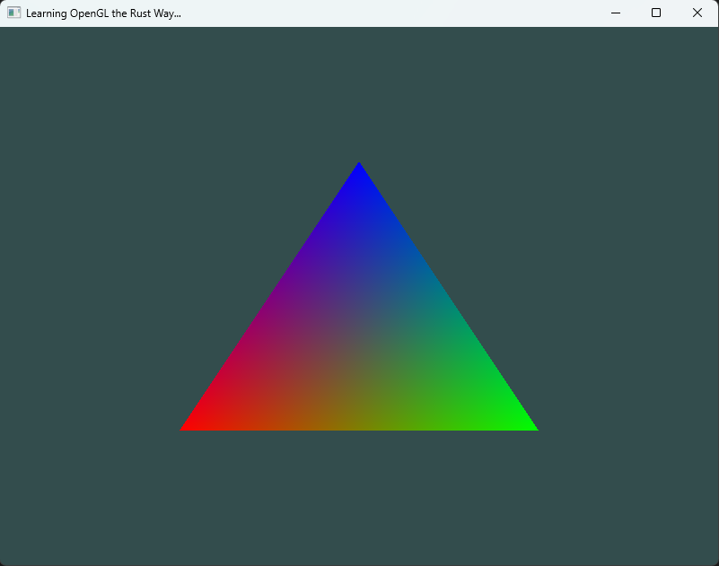
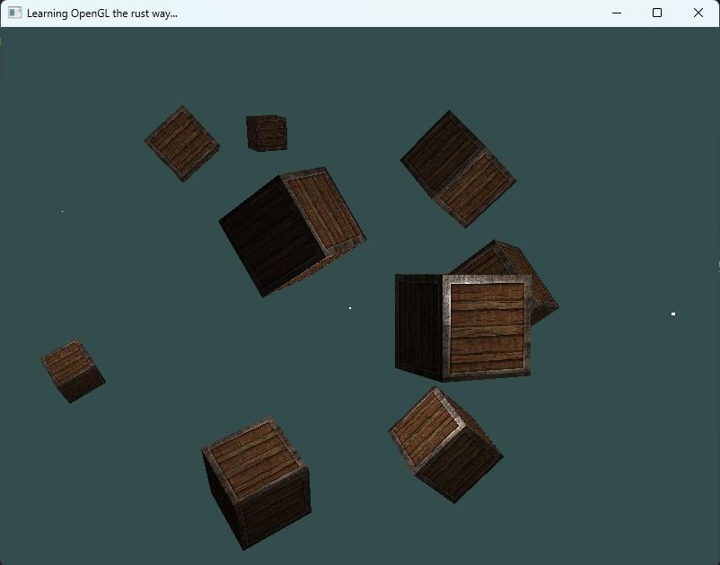
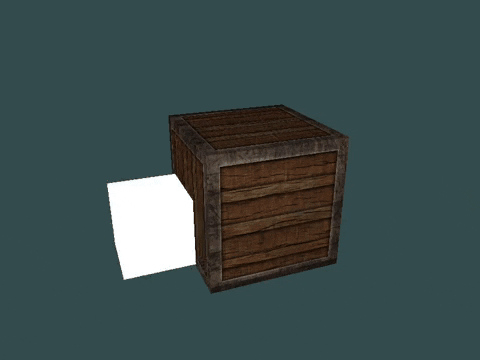
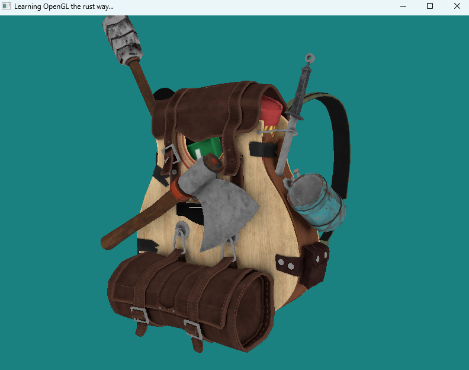
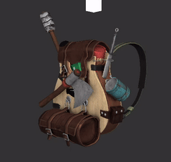

# Learn-OpenGL-Rust

This repository will show my progress learning the graphics API OpenGL in Rust

I will be following the famous tutorial [LearnOpenGL](https://learnopengl.com) by Joey de Vries. Since I started learning Rust, I thought it might a great idea to follow the tutorial using Rust. As a starting and reference point, I will be using the [Rust port](https://github.com/bwasty/learn-opengl-rs) of LearnOpenGL by bwasty.

Start with [Hello Triangle!](./examples/1_getting_started/1_hello_triangle.rs)



# Structure

As of now, I will mainly code in the main.rs file of the src folder. Finished chapters will be converted into examples, which can be run separately.

# How to use the examples

Make sure to use ```cargo build``` before running anything. Since GLFW is used as a dependency you might need CMake installed on your computer to build the project. The examples can be run via the command ```cargo run --example <example_name>```.

## List of the available examples:

1. Getting started:
- hello_triangle
- hello_indexed
- exercise_1_1
- exercise_1_2
- exercise_1_3
- interpolation
- shaderclass
- textures
- multiple_textures
- transformations
- coordinate_system
- 3D_cube
- cubes
- camera_circle
- camera_move

2. Lighting

- colors
- phong_split
- phong_lighting
- phong_exercise_1
- phong_material
- lighting_maps
- emission_map
- directional_light
- pooint_light
- spot_light
- multiple_lights

3. Models

- backpack
- backpack_lighting

## Showcase

This section will show a few examples that this project can produce.

### [3D Cube with transformations](./examples/1_getting_started/12_cube_3d.rs)


### [Several Spotlights with 3D Objects](./examples/2_lighting/10_spot_light.rs)



### [Lighting maps for different Materials](./examples/2_lighting/6_lighting_maps.rs)



### [3D model loading from obj file](./examples/3_model_loading/1_model_loading_backpack.rs)



### [3D backpack model with phong lighting](./examples/3_model_loading/2_backpack_lighting.rs)


